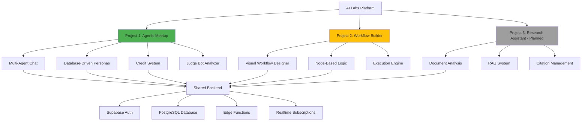
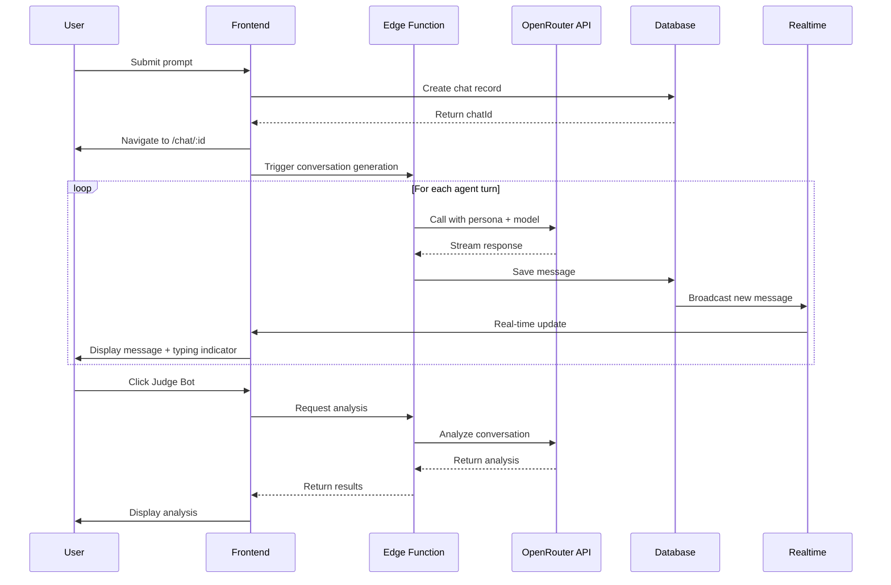
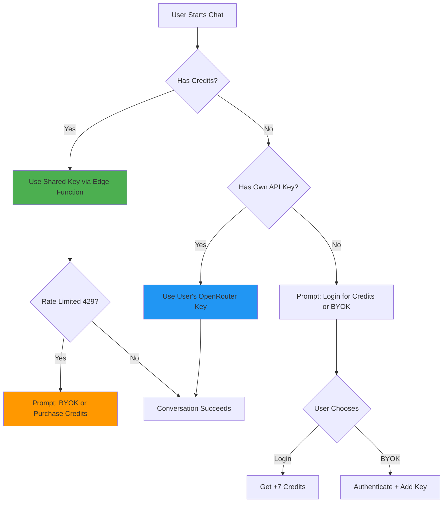
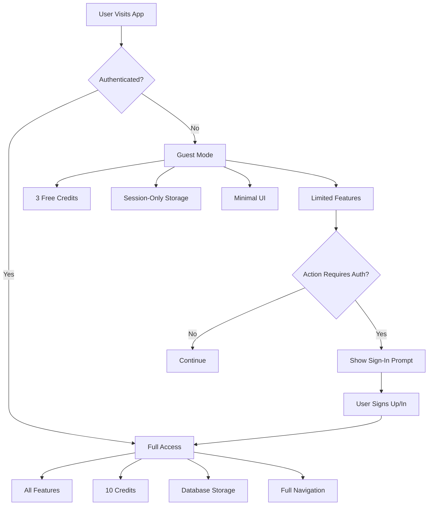

# Product Requirements Document: AI Labs Platform

## Executive Summary

AI Labs is a multi-project platform showcasing advanced AI agent technologies. The platform hosts multiple independent applications that demonstrate different approaches to AI interaction and automation. Each project operates as a standalone application with its own routing, state management, and feature set, while sharing common infrastructure and backend services.

**Current Status**: Project 1 (AI Agents Meetup) is in production. Project 2 (Workflow Builder) is in active development. Project 3 (Research Assistant) is planned.

---

## Architecture Overview



---

## Project 1: AI Agents Meetup

### Overview

AI Agents Meetup is a ChatGPT/Grok-style multi-agent conversation application where 2-3 AI agents with different models and personas discuss user-provided topics. The application emphasizes agentic conversation with structured turn-taking, real-time message streaming, and conversational analysis.

**Routes**: `/labs/agents-meetup/*`

### Core Features

#### 1. Multi-Agent Conversations

- **Agent Count**: 2-3 agents per conversation (configurable)
- **Model Selection**: Each agent uses a different AI model from OpenRouter's catalog
- **Unique Personas**: Each agent has a distinct personality and approach (fetched from database)
- **Turn-Taking Logic**: Structured conversation flow (Agent A → Agent B → Agent C, then follow-ups)
- **Real-Time Streaming**: Messages appear progressively as they're generated (Supabase Realtime)
- **Typing Indicators**: Per-agent typing indicators during generation

#### 2. Conversation Scenarios

Three core scenarios guide conversation structure:

1. **General Problem**: Universal problem-solving and analysis
2. **Ethical Dilemma**: Ethical exploration and moral reasoning
3. **Future Trends**: Speculative discussion about future developments

**Note**: "Text Analysis" scenario was removed to reduce decision fatigue and maintain focus.

#### 3. Database-Driven Agent Personas

Agent personas are centralized in the `agent_profiles` table, replacing hardcoded configurations:

**System Profiles** (always available):
- **Analytical Expert**: Data-driven, logical reasoning
- **Creative Thinker**: Imaginative, unconventional approaches
- **Strategic Planner**: Long-term thinking, strategic insights
- **Empathy Expert**: Human-centered, emotional intelligence

**Future**: Support for user-created custom profiles and premium marketplace profiles.

#### 4. User Authentication & Credit System

**Guest Users**:
- 3 free credits (3 chats)
- Session-only chat storage (localStorage)
- Cannot save, analyze, or access history
- Minimal UI (no sidebar navigation)

**Logged-In Users**:
- 10 total credits (3 initial + 7 signup bonus)
- Persistent database storage
- Full sidebar navigation (Profile, Agent Profiles, API Settings, Settings)
- Real-time chat history updates
- Access to Judge Bot conversation analyzer
- Can provide own OpenRouter API key (BYOK) when credits exhausted

**BYOK (Bring Your Own Key)**:
- Requires authentication (not available to guests)
- API keys stored securely server-side in database
- Enables unlimited conversations
- Positioned as upgrade path when credits exhausted

#### 5. Judge Bot Analyzer

- **Trigger**: Floating action button (Sparkles icon with pulse animation)
- **Personality**: Sports-commentator style analysis
- **Content**: Quick verdict, nerd stats (tokens, cost, charts), detailed analysis
- **Access**: Logged-in users only (guests see sign-in prompt)
- **Purpose**: Entertainment value + incentivizes user signup

### Technical Architecture



### Database Schema

#### `agent_chats`
```sql
- id: uuid (PK)
- user_id: uuid (nullable for guests)
- title: text
- prompt: text
- scenario_id: text
- settings: jsonb (agent configs, models, personas, rounds)
- created_at: timestamp
- updated_at: timestamp
```

#### `agent_chat_messages`
```sql
- id: uuid (PK)
- chat_id: uuid (FK → agent_chats)
- agent: text (agent identifier)
- persona: text (persona slug)
- model: text (OpenRouter model ID)
- message: text (response content)
- created_at: timestamp
```

#### `agent_profiles`
```sql
- id: uuid (PK)
- slug: text (unique, e.g., 'analytical-expert')
- name: text
- description: text (short description)
- instructions: text (full persona system prompt)
- icon_name: text (Lucide icon name)
- is_system: boolean (system vs user-created)
- is_premium: boolean (free vs paid)
- user_id: uuid (nullable, for custom profiles)
- created_at: timestamp
- updated_at: timestamp
```

#### `user_credits`
```sql
- id: uuid (PK)
- user_id: uuid (FK)
- credits_remaining: integer
- credits_used: integer
- created_at: timestamp
- updated_at: timestamp
```

**Realtime Enabled**: `agent_chats`, `agent_chat_messages`

### Edge Functions

#### `openrouter-chat`
- **Purpose**: Proxy requests to OpenRouter API with shared or user API keys
- **Input**: model, persona, messages, conversationHistory, userApiKey (optional)
- **Output**: Streamed or complete AI response
- **Features**: Rate limit handling (429), fallback logic, cost tracking

#### `openrouter-models`
- **Purpose**: Fetch available models from OpenRouter catalog
- **Output**: List of models with pricing, context limits, capabilities

### API Key Strategy



### UI/UX Design

#### Layout
- **Header**: Transparent minimal header (Grok-style)
- **Sidebar**: 
  - Logo and title at top
  - Chat history organized by date (Today, Yesterday, Previous 7 Days, etc.)
  - Real-time updates via Supabase subscriptions (logged-in) or custom events (guests)
  - Footer menu with Profile, Agent Profiles, API Settings, Settings (logged-in only)
  - Modern toggle buttons (PanelLeft/PanelLeftClose icons)
- **Main Area**: Full-height immersive chat interface

#### Landing Page (New Chat View)
- **Unified Input Card**:
  - Scenario pills at top (subtle bottom border)
  - Textarea in middle (no individual border)
  - Suggested topics at bottom (subtle top border)
  - All elements feel like one cohesive prompt composition unit
- **Conversation Settings**: Number of agents, rounds, response length (always visible)
- **Agent Configuration**: 3-agent grid with model + persona selectors (always visible)
- **Design Philosophy**: Balance Apple-style minimalism with transparency of multi-agent customization features

#### Chat View
- **Message Display**: Agent avatar, name, persona, message content
- **Round Separators**: Visual markers between conversation rounds
- **Typing Indicators**: Per-agent animated indicators during generation
- **Judge Bot Button**: Floating action button (bottom-right) when conversation complete

#### Analysis Drawer
- **Trigger**: Judge Bot floating button
- **Content**: Quick verdict, collapsible nerd stats, full analysis
- **Access Control**: Logged-in users only; guests see sign-in prompt

### Navigation Flow

```mermaid
graph LR
    A[Landing Page] -->|Submit Prompt| B[Create Chat Record]
    B -->|Immediate Navigate| C[/chat/:id]
    C -->|Load Chat View| D[Subscribe to Realtime]
    C -->|Load Chat View| E[Trigger Conversation Generation]
    E -->|Messages Stream| D
    D -->|Display Messages| F[Chat Interface]
    
    F -->|Click Sidebar Chat| G[/chat/:otherId]
    F -->|Click New Chat| A
    F -->|Click Profile| H[/profile]
    F -->|Click Agent Profiles| I[/agent-profiles]
    F -->|Click API Settings| J[/api-settings]
    F -->|Click Settings| K[/settings]
```

---

## Project 2: Agent Workflow Builder

### Overview

A visual workflow automation tool inspired by n8n, featuring drag-and-drop node-based logic, data flow visualization, and execution engine. Users build workflows by connecting specialized nodes (triggers, actions, logic, AI) on a canvas.

**Routes**: `/labs/workflow-builder`

### Planned Features

#### Node Categories

1. **Trigger Nodes**
   - Manual Trigger
   - Webhook
   - Schedule
   - Database Event

2. **Action Nodes**
   - HTTP Request (GET, POST, PUT, DELETE)
   - Database Operation (CRUD)
   - Send Email
   - File Operations

3. **Logic Nodes**
   - If/Else Conditional
   - Switch (multiple conditions)
   - Filter (array filtering)
   - Set (variable assignment)
   - Merge (combine data)

4. **Utility Nodes**
   - Code (JavaScript execution)
   - Transform (data mapping)
   - Delay
   - Error Handler

5. **AI Nodes**
   - AI Agent (conversational AI)
   - AI Model (completion)
   - AI Memory (context persistence)
   - Prompt Template

#### Core Features

- **Visual Designer**: ReactFlow-based canvas with zoom, pan, minimap
- **Drag & Drop**: Node palette → canvas
- **Visual Connections**: Connect node output → input handles
- **Node Configuration**: Tabbed interface for parameters, credentials, test data
- **Conditional Branching**: If/Switch nodes with multiple output paths
- **Execution**: Run workflows, visualize data flow, track execution state
- **Real-Time Visualization**: See data moving through nodes during execution
- **Credentials Manager**: Securely store API keys, tokens, connection strings
- **Save/Load/Export**: Persist workflows, share JSON definitions

### Technical Architecture

- **Canvas**: `@xyflow/react` (ReactFlow)
- **State Management**: React Context + useReducer
- **Node System**: Modular components, each node = dedicated React component
- **Execution Engine**: Topological sort → execute nodes in dependency order
- **Data Flow**: Pass output from node N as input to node N+1

---

## Project 3: AI Research Assistant (Planned)

### Overview

An intelligent research assistant that helps users gather, analyze, and synthesize information from multiple sources. Combines document analysis, web search, and AI summarization.

**Routes**: `/labs/research-assistant` (planned)

### Planned Features

- **Multi-Source Gathering**: Upload documents, scrape web pages, API integrations
- **Document Analysis**: PDF parsing, text extraction, OCR
- **AI Summarization**: Generate summaries, key points, insights
- **Citation Management**: Track sources, generate citations
- **Export**: Markdown, PDF, Word documents
- **RAG (Retrieval Augmented Generation)**: Vector embeddings, semantic search

---

## Shared Infrastructure

### Technology Stack

**Frontend**:
- React 18.3 + TypeScript
- Vite (build tool)
- Tailwind CSS + shadcn/ui components
- Radix UI primitives
- Lucide React (icons)
- React Query (server state)
- React Context (client state)
- React Router DOM (routing)

**Backend**:
- Supabase (via Lovable Cloud)
  - PostgreSQL database
  - Authentication (email/password, OAuth)
  - Edge Functions (Deno runtime)
  - Realtime subscriptions
- OpenRouter API (AI model access)

**Key Dependencies**:
- `@tanstack/react-query`: Server state, caching, mutations
- `@xyflow/react`: Workflow canvas (Project 2)
- `react-router-dom`: Client-side routing
- `@supabase/supabase-js`: Backend SDK
- `recharts`: Data visualization (analytics)

### Design System

- **Colors**: HSL semantic tokens defined in `index.css` and `tailwind.config.ts`
- **Components**: shadcn/ui (customizable Radix primitives)
- **Typography**: System font stack with display font accents
- **Theme**: Dark/light mode support via `next-themes`
- **Animations**: Tailwind CSS animations, framer-motion (future)

### Authentication Flow



---

## Success Metrics

### AI Agents Meetup

- **Engagement**: Number of multi-agent conversations generated
- **User Growth**: Guest → logged-in conversion rate
- **Monetization**: BYOK adoption rate, credit purchases (future)
- **Retention**: Returning users, chat history usage
- **Feature Adoption**: Analysis feature usage, custom agent profiles (future)

### Workflow Builder

- **Adoption**: Number of workflows created
- **Complexity**: Average nodes per workflow
- **Execution**: Successful workflow runs
- **Sharing**: Workflow templates shared

---

## Roadmap

### ✅ Completed (Agents Meetup)

- [x] Multi-agent conversation system
- [x] OpenRouter API integration with shared key
- [x] Real-time message streaming (Supabase Realtime)
- [x] Credit system (guest + logged-in)
- [x] Database-driven agent personas
- [x] Judge Bot conversation analyzer
- [x] Chat history with real-time updates
- [x] BYOK (Bring Your Own Key) with authentication requirement
- [x] Three core conversation scenarios
- [x] Grok-style UI with immersive chat experience

### 🚧 In Progress

- [ ] Workflow Builder (node system, canvas, execution engine)
- [ ] Custom agent profiles (user-created personas)
- [ ] Agent profile editing interface

### 📋 Planned

- [ ] Agent Marketplace (premium profiles, user-created profiles)
- [ ] Stripe integration (credit purchases)
- [ ] AI Research Assistant (new project)
- [ ] Conversation branching (edit message, regenerate from point)
- [ ] Export conversations (PDF, Markdown, JSON)
- [ ] Random agent turn-taking mode (alternative to sequential A→B→C)
- [x] User Participation Mode (join multi-agent conversations as active participant)
- [ ] Workflow templates and sharing
- [ ] Team workspaces and collaboration
- [ ] Analytics dashboard

---

## Appendix

### Key Files

**Agents Meetup**:
- Routes: `src/pages/labs/projects/agents-meetup/index.tsx`
- Layout: `src/pages/labs/projects/agents-meetup/layout/`
- Views: `src/pages/labs/projects/agents-meetup/views/`
- Hooks: `src/pages/labs/projects/agents-meetup/hooks/`
- Types: `src/pages/labs/projects/agents-meetup/types.ts`
- Edge Function: `supabase/functions/openrouter-chat/index.ts`

**Workflow Builder**:
- Routes: `src/pages/labs/projects/workflow-builder/index.tsx`
- Components: `src/pages/labs/projects/workflow-builder/components/`
- Node Definitions: `src/pages/labs/projects/workflow-builder/constants/nodeDefinitions.ts`

**Shared**:
- Supabase Client: `src/integrations/supabase/client.ts`
- Database Types: `src/integrations/supabase/types.ts`
- OpenRouter Utils: `src/utils/openRouter/`

### Environment Variables

```bash
VITE_SUPABASE_URL=<auto-configured>
VITE_SUPABASE_PUBLISHABLE_KEY=<auto-configured>
VITE_SUPABASE_PROJECT_ID=<auto-configured>
```

**Note**: `.env` file is auto-generated and should never be edited manually.

---

**Last Updated**: 2025-11-26
**Version**: 1.0
**Status**: Living Document
